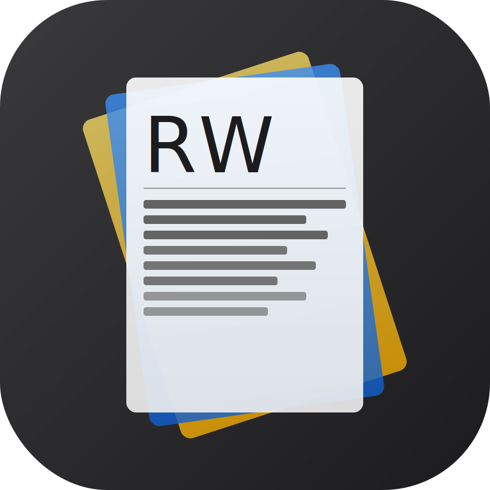

# RelatedWorks

<p align="center">
  
</p>

> ⚠️ This project is purely vibe coded — built entirely through AI-assisted development without traditional planning or architecture review. Expect rough edges.

RelatedWorks is a native macOS and iOS/iPadOS app built for Computer Science researchers. Organize your research literature, take interconnected notes, and generate LaTeX-ready Related Works sections — powered by AI.

## 🧪 Beta Test

The macOS App Store and iOS App Store versions are coming soon! Join the public beta on TestFlight now:

**[Join Beta on TestFlight →](https://testflight.apple.com/join/B1VxbrDv)**

## Features

- **Project-based workspaces** — one project per paper you're writing
- **Import PDFs with AI-powered metadata extraction** (macOS only)
- **Search DBLP and arXiv** to fetch bibliographic data automatically (macOS only)
- **Semantic IDs** — give each paper a short memorable tag like `@Transformer` or `@BERT`
- **Cross-reference annotations** — link papers using `@mentions` in your notes
- **Generate a LaTeX-ready Related Works draft** with one click (macOS only)
- **Export BibTeX entries** fetched from DBLP or auto-generated (macOS only)
- **iCloud Drive sync** — keep your library in sync across Mac and iPhone/iPad
- **Export and import projects** as `.relatedworks` files (macOS); **import projects** on iPhone and iPad
- **Supports Ollama** and **Google Gemini** (macOS only)
- **iPhone and iPad companion app** — browse papers, review notes, and make lightweight edits on the go
- **Terminal UI (TUI)** — keyboard-driven and SSH/headless use (macOS only, distributed via GitHub release)
- **Deep link support** — `relatedworks://` URIs for every paper and project

## Requirements

### macOS App
- Released binaries require macOS 26+ (built with Xcode 26 / macOS 26 SDK)
- At least one AI backend:
  - [Ollama](https://ollama.com) running locally, **or**
  - [Google Gemini API key](https://aistudio.google.com/apikey)
- Source builds require macOS 13+

### iOS/iPadOS App
- Released binaries require iOS 26+ (built with Xcode 26 / iOS 26 SDK)
- No AI backend required — the iPhone and iPad app is focused on viewing and lightweight editing
- Source builds require iOS 17+

## Quick Start

1. **Create a project** — each project represents the paper you're writing
2. **Add papers** — import a PDF, search DBLP/arXiv on macOS, or enter metadata manually
3. **Annotate** — write notes using `@mentions` to cross-reference related papers
4. **Generate** — click **Generate Related Works** on macOS for a LaTeX-ready draft
5. **Take it with you** — browse, review, and refine annotations on iPhone or iPad via iCloud sync

## iCloud Sync

Enable in **Settings → General → Sync via iCloud Drive** (macOS) or **Settings → iCloud** (iOS).

- On **macOS**: existing local data is migrated to iCloud Drive
- On **iOS**: the app switches to reading from iCloud Drive; local data is not moved

## iPhone And iPad Companion App

On iPhone and iPad, RelatedWorks is designed primarily as a companion viewer and lightweight editor for your research library. The iOS/iPadOS app does not require or rely on any AI backend; instead, it syncs your library seamlessly from the macOS version via iCloud.

You can comfortably browse papers, review notes, and refine annotations on the go, making it easy to continue working on your literature wherever you are. Any annotations you edit on iPhone or iPad automatically sync back to your Mac, giving you a smooth companion workflow for reading and writing. On iPhone and iPad, RelatedWorks supports project import, but project export remains macOS-only.

## Terminal UI (TUI)

The TUI is a macOS-only companion distributed as a GitHub release. It is intended for keyboard-driven and SSH/headless workflows against the same project library.

```bash
# Run from source
swift run RelatedWorksTUI

# Or use the bundled binary from the GitHub release
./relatedworks-tui
```

By default the TUI reads from local storage. To use iCloud projects, pass the path manually — this is required because Apple restricts iCloud entitlements to sandboxed app bundles, and the TUI is a command-line tool:

```bash
./relatedworks-tui --projects-dir ~/Library/Mobile\ Documents/iCloud~me~snowzjx~relatedworks/Documents/projects
```

| Key | Action |
|-----|--------|
| `↑` / `↓` | Navigate |
| `Enter` | Select |
| `/` | Search |
| `Esc` | Back |
| `Ctrl+D` | Quit |

## Building

```bash
# macOS app
xcodebuild -project RelatedWorksApp.xcodeproj -scheme RelatedWorksApp \
  -configuration Release build

# iOS app
xcodebuild -project RelatedWorksApp.xcodeproj -scheme RelatedWorksIOS \
  -destination 'generic/platform=iOS' -configuration Release build

# TUI
swift build -c release --product RelatedWorksTUI
```

## AI Backends

| Backend | Setup |
|---------|-------|
| Ollama | Install from [ollama.com](https://ollama.com), run locally |
| Gemini | API key from [Google AI Studio](https://aistudio.google.com/apikey) |

Configure in **Settings → AI Backends** and **Settings → Models**.

## Deep Links

```
relatedworks://open?project=<UUID>
relatedworks://open?project=<UUID>&paper=<SemanticID>
```

Works on both macOS and iOS.

## Data Storage

| Mode | Location |
|------|----------|
| Local | `~/Library/Application Support/RelatedWorks/projects/` |
| iCloud | `~/Library/Mobile Documents/iCloud~me~snowzjx~relatedworks/Documents/projects/` |
